# Windows 10 + Ubuntu 双系统安装、显卡驱动安装及排错指南

## 前言
本教程为Windows10安装Ubuntu双系统教程，基于[此教程](https://www.cnblogs.com/masbay/p/11627727.html)进行修改。

进一步添加了显卡三件套 (nVidia Driver + CUDA + cuDNN) 安装及配置

## Tips
由于电脑品牌多样，碰到问题可能本教程并未涵盖，大家可以自行搜索后尝试解决，并且可以将自己问题和解决方法提交至issue，从而使教程更加丰富
## 目录
[一、查看电脑信息](#一查看电脑信息)

[二、制作系统盘](#二制作系统盘)

[三、(关键!) 在Windows下创建空白分区](#三关键-在windows下创建空白分区)

[四、(关键!) 开始安装](#四关键-开始安装)

[五、安装显卡三件套](#五安装显卡三件套)

## 一、查看电脑信息

### 1.查看BIOS类别

使用"Win + R"组合键调出运行窗口，在对话框输入"msinfo32"，出现下述界面，以查看BIOS模式：

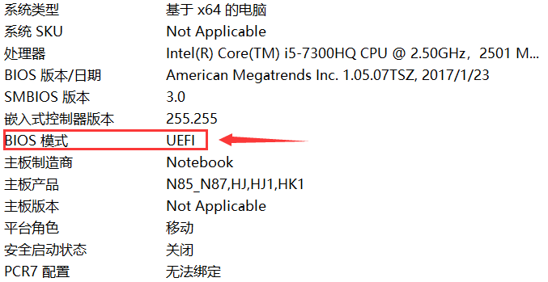

确定BIOS模式为UEFI. 新电脑大多数为UEFI模式，本教程仅基于UEFI模式的BIOS进行安装。

### 2.查看硬盘

在左下角Win Logo上点击鼠标右键，进入磁盘管理：

* **双硬盘**

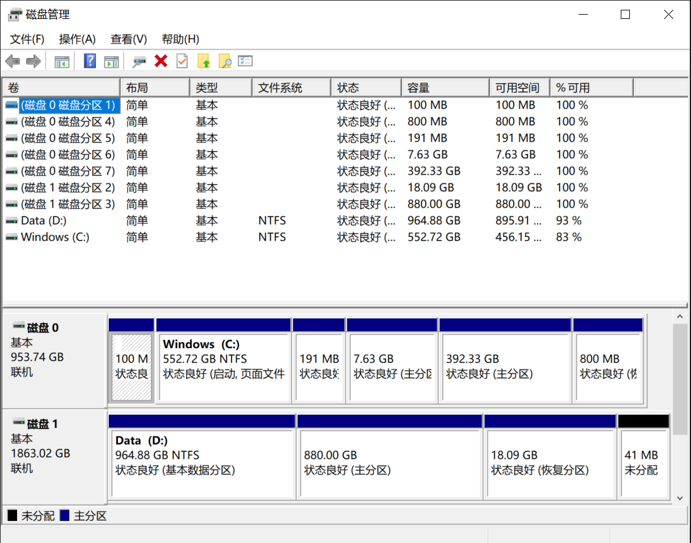 

* **单硬盘**

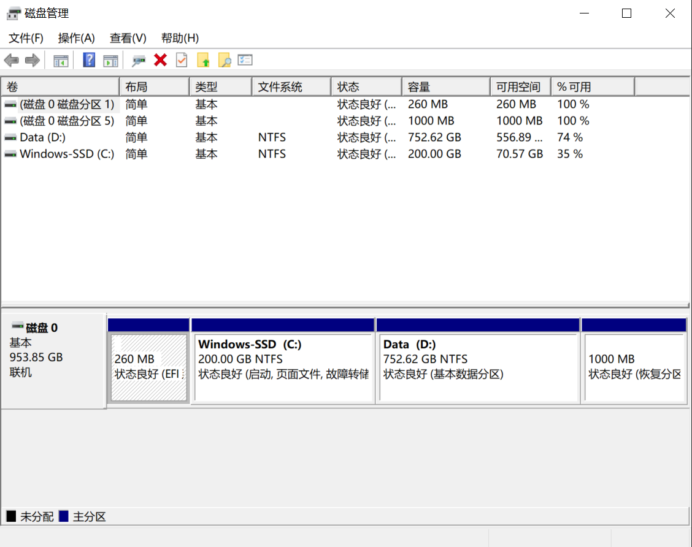

考虑实际需要，本教程基于双硬盘设备进行讲解

## 二、制作系统盘

需要准备以下工具：

1. [Ubuntu镜像](https://cn.ubuntu.com/download/desktop) (链接为最新版Ubuntu LTS，[旧版本传送门](https://cn.ubuntu.com/download/alternative-downloads))
2. [Rufus刻录工具](https://rufus.ie/zh/)
3. 一个8G以上的U盘

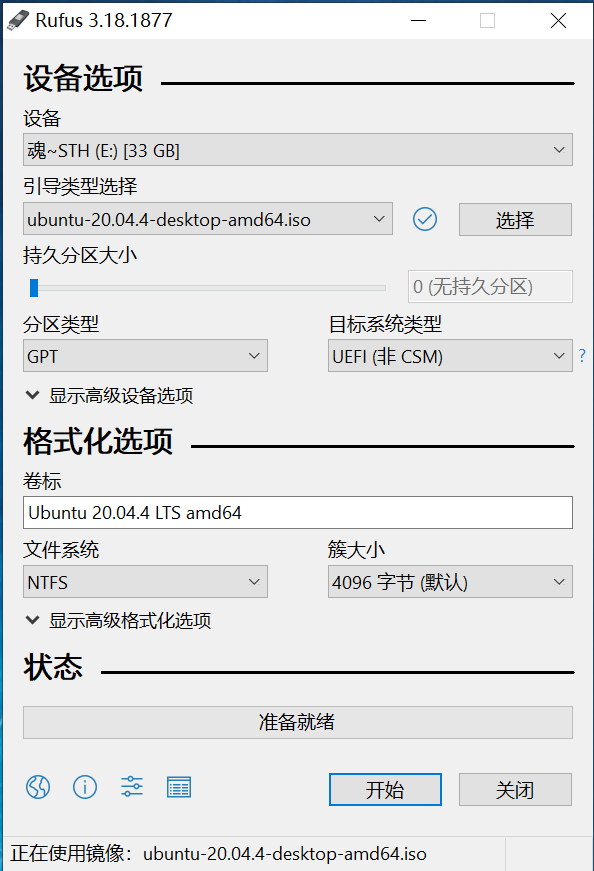

按图中设置好各项后，点击"开始"，进度条走完之后，点击"关闭"

## 三、**(关键!)** 在Windows下创建空白分区

此步骤将直接影响Ubuntu系统内可用空间及两个系统的启动，需要注意。

### 1. 分区步骤

(1). 进入"磁盘管理"

(2). 右键点击需要分割的分区，选择"**压缩卷**"，输入要获得分区的大小(1024M = 1G)

### 2. 分区大小

* 先在Windows系统所在硬盘内划分出200M左右，用于后期存放Ubuntu系统的启动项
* 对于超过1TB的固态硬盘，可将一半空间划分出来给Ubuntu系统，用于预留后期安装anaconda环境、显卡三件套的空间
* 在第二块硬盘中划分出适当空间，作为Ubuntu存储数据的分区
  
我的分区结果：191MB+7.63GB+392.33GB 留给 Ubuntu，由于系统已经安装完成，故显示3个分区，如未安装系统，则只显示"**未分配**"


  
## 四、**(关键!)** 开始安装

### 预准备

搜索自己电脑进入BIOS的快捷键，检索格式为 “电脑型号 + 进入BIOS”, 例如 “联想拯救者Y7000P 2020 进入BIOS”
搜索如何开机时使用USB引导

### 1.BIOS设置

插好系统盘，重启电脑，开机进bios，在Security页面，关掉Secure Boot（不同电脑secure boot可能在不同位置），然后到Boot页面，如果有Fast Boot这一项），也把它关掉，没有忽略；然后保存更改，在Boot页面下方启动项选择 USB启动，回车，如果顺利进入安装页面，继续往下做；如果点击USB启动项无法进入，保存并退出，电脑会重启，根据自己电脑按相应的键进boot manager，找到USB启动项，回车即可进入。

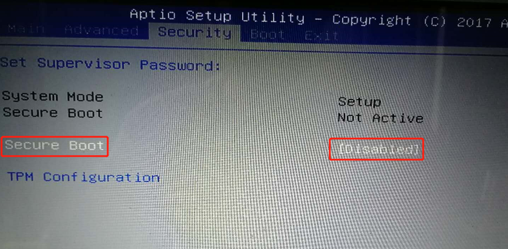

### 2.安装系统

* 如果成功使用USB安装盘引导，则会进入类似界面，此时选择“Install Ubuntu”，新版安装界面可能为“Try or install Ubuntu”

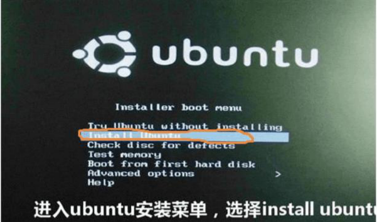

* 选择语言，在语言选择栏最靠下的部分选择中文，点击“安装Ubuntu”

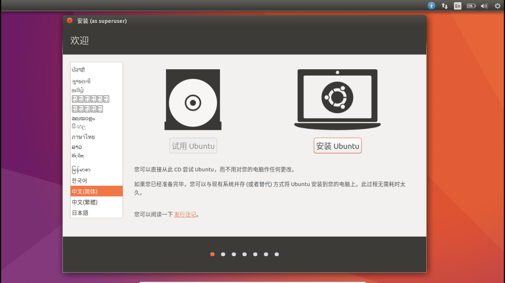

* 不选择“安装时下载更新”，选择“为图形和无线硬件…………”，点击“继续”

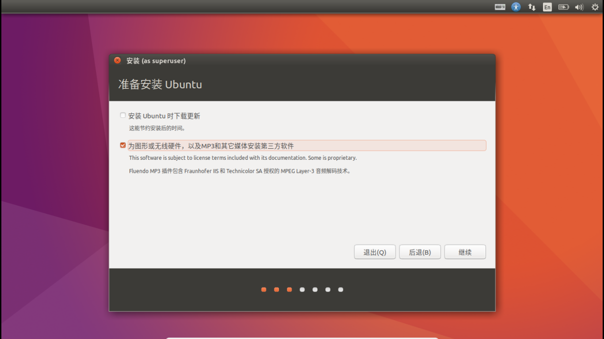

* 出现类似页面，一定选择“其他选项”进行自定义安装，不要选择另外选项，即使是“install Ubuntu alongside Windows10”! 否则可能会导致Windows无法启动！

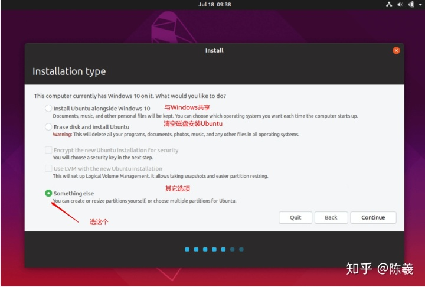

* Ubuntu内分区界面, 找到前期在Win 中获取的空闲分区，点击"+"进行分区

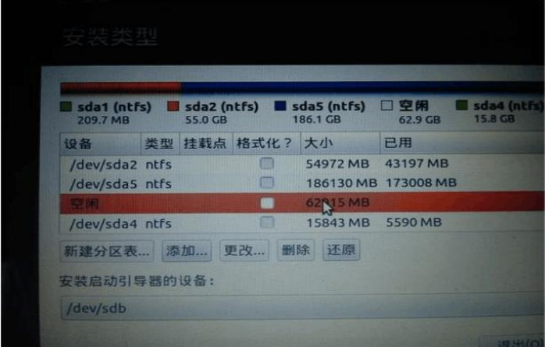

| 空间大小 | 挂载点 | 新分区位置 | 用于 | 分区类型 |
|:-------:|:----|----------|-----|-------|
| 200MB            |  EFI | 空间起始位置 | efi            | 逻辑分区|
|   8GB            | SWAP | 空间起始位置 | swap或交换空间  | 逻辑分区|
|固态硬盘剩余空闲大小|   /  | 空间起始位置 | ext4日志文件系统| 主分区  |
|机械硬盘剩余空闲大小| /home| 空间起始位置 | ext4日志文件系统| 逻辑分区|

* 安装启动引导器的设备，注意选择成刚分配的efi分区名
* 确认后设置用户、键盘、时区等，等待安装完成

## 五、安装显卡三件套

### 1. 检查现有的显示驱动

打开终端，输入命令 `nvidia-smi`, 如果有显卡信息输出，则预装了nVidia显卡驱动，否则为开源 nouveau 驱动

### 2. 安装三件套

#### 情况一 已有显卡驱动

为保证稳定使用，须删除预装的nvidia驱动。
Ctrl + Alt + F1 进入命令行界面，输入以下命令

```s
sudo apt-get purge nvidia-*
```

等待命令执行完成后，再输入 `nvidia-smi` 检查是否有显卡信息输出，没有输出则已经卸载完毕

从nVidia官网获取CUDA (以下命令示例为最新版CUDA 11.7)

```s
wget https://developer.download.nvidia.com/compute/cuda/11.7.0/local_installers/cuda_11.7.0_515.43.04_linux.run
sudo sh cuda_11.7.0_515.43.04_linux.run
```

(以下图片并非安装11.7版本，仅作为示例) 输入accept

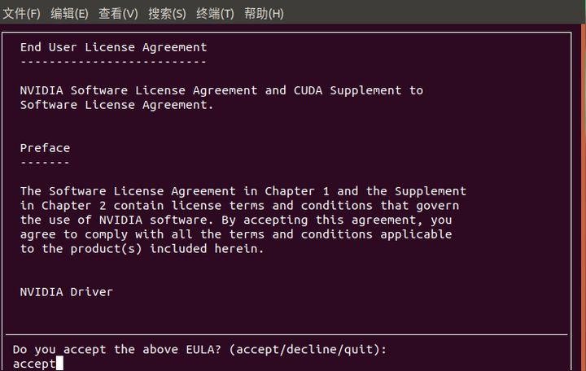

在所有选项前都画X，包括Driver, 选择 Install, 等待安装完成

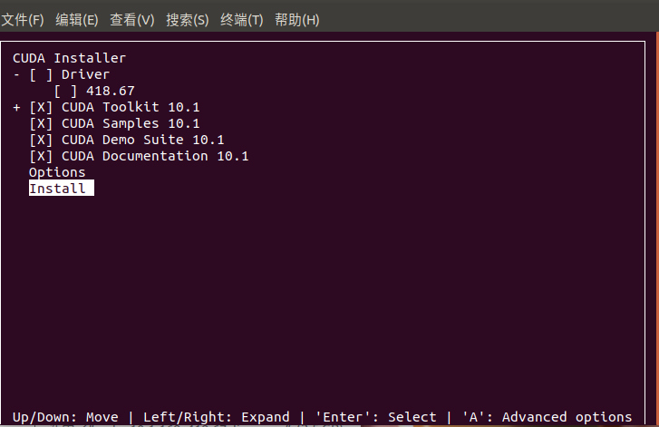

配置环境变量

```s
sudo vi ~/.bashrc
```

在弹出的编辑器中按 i 键，左下角显示'INSERT'即可进行输入

最后一行添加, xx.x为具体的cuda版本

```sh
export LD_LIBRARY_PATH=$LD_LIBRARY_PATH:/usr/local/cuda-xx.x/lib64
export PATH=$PATH:/usr/local/cuda-xx.x/bin
export CUDA_HOME=$CUDA_HOME:/usr/local/cuda-x.x
```

按ESC退出编辑模式，输入`:wq`进行保存（记得加冒号），输入`source ~/.bashrc`激活新的配置文件，之后可输入`nvidia-smi`检查驱动是否安装成功，`nvcc -V`检查CUDA是否安装成功，如果二者都安装成功，重启即可进入图形界面

[下载cuDNN](https://developer.nvidia.com/rdp/cudnn-download#a-collapse841-116) (传送门)

进入存放目录，之后将压缩文件提取，再依次键入以下命令

```s
sudo cp cuda/include/cudnn.h /usr/local/cuda/include/
sudo cp cuda/lib64/libcudnn* /usr/local/cuda/lib64/
sudo chmod a+r /usr/local/cuda/include/cudnn.h
sudo chmod a+r /usr/local/cuda/lib64/libcudnn*
```

检查cuDNN安装情况,键入以下命令，有`#define`之类的输出即安装成功

```
cat /usr/local/cuda/include/cudnn_version.h | grep CUDNN_MAJOR -A 2
```

#### 情况二 未预装显卡驱动

禁用nouveau驱动：Ctrl + Alt + F1 进入命令行界面，输入以下命令打开黑名单
```s
sudo vi /etc/modprobe.d/blacklist-nouveau.conf
```
按i键进入INSERT模式，在黑名单中添加以下命令后，按ESC退出编辑模式，输入`:wq`进行保存（记得加冒号）
```s
blacklist nouveau
options nouveau modeset=0
```
更新initramfs
```s
sudo update-initramfs -u
```
重启后会发现黑屏，只有左上角光标闪烁，这表示显示驱动没有正确安装，属于正常现象，Ctrl + Alt + F2 进入命令行界面，输入以下命令没有输出则表示禁用成功，随后可按照[情况一](#情况一-已有显卡驱动)安装三件套：
```s
lsmod | grep nouveau
```
